```mermaid
graph TD
    A[🎯 Enterprise Architecture] --> B[Microservices Design]
    A --> C[Event-Driven Systems]
    A --> D[Cloud-Native Solutions]
    
    B --> E[Spring Boot Ecosystem]
    B --> F[API Gateway Patterns]
    
    C --> G[Apache Kafka]
    C --> H[Event Sourcing]
    
    D --> I[Kubernetes Orchestration]
    D --> J[Serverless Computing]
    
    E --> K[🚀 Scalable Solutions]
    F --> K
    G --> K
    H --> K
    I --> K
    J --> K
    
    K --> L[🏆 Business Success]
    
    style A fill:#667eea
    style K fill:#764ba2
    style L fill:#f093fb
```

<div align="center">

<!-- Hero Header with Animated Background -->


<!-- Animated Typing Header -->
<a href="https://git.io/typing-svg">
  
</a>

<!-- Glowing Divider -->


</div>


<!-- Professional Badge Collection -->
<div align="center">


</div>

<!-- Animated About Section -->
<h2 align="center">
  
  <b>SENIOR BACKEND ENGINEER & SYSTEM ARCHITECT</b>
  
</h2>

<div align="center">

```typescript
const rameshSapkota = {
  title: "Senior Backend Engineer",
  company: "@sitaulaTechSolutions",
  location: "🇳🇵 Damak, Province No. 1, Nepal",
  
  expertise: {
    architecture: ["Microservices", "Event-Driven", "Serverless"],
    frameworks: ["Spring Boot", "Spring Cloud", "Spring Security"],
    databases: ["PostgreSQL", "MongoDB", "Redis", "Elasticsearch"],
    cloud: ["AWS", "Docker", "Kubernetes", "Terraform"],
    specialties: ["System Design", "Performance Optimization", "Security"]
  },
  
  currentMission: "Building next-generation enterprise systems",
  philosophy: "Clean Code + Scalable Architecture = Success 🚀",
  openForCollaboration: true,
  
  getContactInfo: () => ({
    email: "rameshsapkota900@gmail.com",
    portfolio: "https://ramesh-sapkota.com.np/",
    linkedin: "ramesh-sapkota-122ab4372",
    github: "rameshsapkota900"
  })
};
```

</div>

<!-- Interactive Tech Stack with Animations -->
<h2 align="center">
  
  <b>TECHNOLOGY ARSENAL</b>
  
</h2>

<div align="center">

<!-- Core Backend Technologies -->
<table>
<tr>
<td align="center" width="25%">
<h3>⚡ Core Technologies</h3>

<br><br>


</td>

<td align="center" width="25%">
<h3>🗄️ Data & Storage</h3>

<br><br>


</td>

<td align="center" width="25%">
<h3>☁️ Cloud & DevOps</h3>

<br><br>


</td>

<td align="center" width="25%">
<h3>🛠️ Tools & IDE</h3>

<br><br>


</td>
</tr>
</table>

</div>

<!-- Glowing Divider -->


<!-- GITHUB ANALYTICS WITH CUSTOM STYLING -->
<h2 align="center">
  
  <b>GITHUB PERFORMANCE ANALYTICS</b>
  
</h2>

<div align="center">

<!-- Stats Cards with Premium Design -->
<table>
<tr>
<td>

</td>
<td>

</td>
</tr>
</table>

<!-- GitHub Streak with Enhanced Styling -->


<!-- Activity Graph with Premium Theme -->


<!-- Trophy Display -->


</div>

<!-- Animated Section Divider -->


<!-- EXPERTISE SHOWCASE -->
<h2 align="center">
  
  <b>ENTERPRISE ARCHITECTURE EXPERTISE</b>
  
</h2>

<div align="center">

```java
@Component
@Profile("production")
@Slf4j
public class ArchitecturalExpertise {
    
    @Value("${expert.level}")
    private final String EXPERTISE_LEVEL = "SENIOR";
    
    @Autowired
    private List<CoreSkill> coreSkills;
    
    @EventListener
    @Async("taskExecutor")
    public void demonstrateCapabilities() {
        
        // 🏗️ SYSTEM ARCHITECTURE
        SystemArchitecture architecture = SystemArchitecture.builder()
            .pattern(MICROSERVICES)
            .communication(EVENT_DRIVEN)
            .scalability(HORIZONTAL)
            .resilience(CIRCUIT_BREAKER)
            .security(ZERO_TRUST)
            .build();
            
        // ⚡ PERFORMANCE OPTIMIZATION
        PerformanceMetrics metrics = performanceOptimizer
            .enableCaching(REDIS_CLUSTER)
            .optimizeQueries(N_PLUS_ONE_ELIMINATION)
            .implementConnectionPooling(HIKARI_CP)
            .enableCompression(GZIP)
            .achieveTargetLatency("< 100ms");
            
        // 🛡️ SECURITY IMPLEMENTATION
        SecurityConfiguration security = SecurityConfiguration.builder()
            .authentication(JWT_OAUTH2)
            .authorization(RBAC)
            .encryption(AES_256)
            .compliance(GDPR_SOC2)
            .vulnerabilityScanning(SONARQUBE)
            .build();
            
        log.info("🚀 Enterprise-grade system architecture deployed successfully!");
    }
}
```

</div>

<!-- Premium Skills Matrix -->
<div align="center">

| 🎯 **Architecture Domain** | 🛠️ **Technologies** | � **Expertise Level** | �📈 **Business Impact** |
|:---|:---|:---:|:---|
| **Microservices Design** | Spring Boot, Spring Cloud, API Gateway | ⭐⭐⭐⭐⭐ | Scalable enterprise systems |
| **API Development** | REST, GraphQL, OpenAPI, Swagger | ⭐⭐⭐⭐⭐ | Developer-friendly interfaces |
| **Database Architecture** | PostgreSQL, MongoDB, Redis, JPA | ⭐⭐⭐⭐⭐ | High-performance data layer |
| **Cloud Engineering** | AWS, Docker, Kubernetes, Terraform | ⭐⭐⭐⭐⭐ | Modern deployment strategies |
| **Security Engineering** | Spring Security, OAuth2, JWT | ⭐⭐⭐⭐⭐ | Enterprise-grade protection |
| **Performance Tuning** | JVM Optimization, Caching, Monitoring | ⭐⭐⭐⭐⭐ | Sub-100ms response times |

</div>

<!-- Animated Section Divider -->


<!-- CURRENT FOCUS SECTION -->
<h2 align="center">
  
  <b>CURRENT INNOVATION FOCUS</b>
  
</h2>

<div align="center">



</div>

<!-- Innovation Highlights -->
<div align="center">

<table>
<tr>
<td align="center" width="33%">

<h3>�️ System Architecture</h3>
<p><strong>Designing enterprise-grade microservices architectures with event-driven communication patterns</strong></p>
</td>
<td align="center" width="33%">

<h3>⚡ Performance Engineering</h3>
<p><strong>Optimizing systems for sub-100ms response times with advanced caching and database tuning</strong></p>
</td>
<td align="center" width="33%">

<h3>🛡️ Security Architecture</h3>
<p><strong>Implementing zero-trust security models with OAuth2, JWT, and comprehensive threat protection</strong></p>
</td>
</tr>
</table>

</div>

<!-- Animated Section Divider -->


<!-- PREMIUM CONTACT SECTION -->
<h2 align="center">
  
  <b>LET'S BUILD THE FUTURE TOGETHER</b>
  
</h2>

<div align="center">

<!-- Interactive Contact Buttons -->
<a href="mailto:rameshsapkota900@gmail.com">
  
</a>

<a href="https://ramesh-sapkota.com.np/">
  
</a>

<a href="https://linkedin.com/in/ramesh-sapkota-122ab4372">
  
</a>

<a href="https://twitter.com/ramesh22sapkota">
  
</a>

</div>

<!-- Collaboration Section -->
<div align="center">

<h3>🚀 <b>Open for Exciting Collaborations</b> 🚀</h3>

<table>
<tr>
<td align="center" width="20%">

<br><b>Enterprise APIs</b>
</td>
<td align="center" width="20%">

<br><b>Microservices</b>
</td>
<td align="center" width="20%">

<br><b>Cloud Migration</b>
</td>
<td align="center" width="20%">

<br><b>Performance Tuning</b>
</td>
<td align="center" width="20%">

<br><b>System Architecture</b>
</td>
</tr>
</table>

</div>

<!-- Company Information -->
<div align="center">

<h3>🏢 <b>Professional Details</b></h3>

```yaml
Company: "@sitaulaTechSolutions"
Location: "Damak, Province No. 1, Nepal 🇳🇵"
Role: "Senior Backend Engineer & System Architect"
Experience: "Enterprise-grade system development"
Availability: "Open for challenging projects & collaborations"
Timezone: "Nepal Standard Time (UTC+5:45)"
```

</div>

<!-- Footer with Animation -->
<div align="center">


<!-- Visitor Counter with Premium Styling -->


<!-- Quote -->
<h3>💫 <i>"Code is like humor. When you have to explain it, it's bad."</i> 💫</h3>

<!-- Connect Animation -->

<b> Let's connect and build something amazing together! </b>


</div>
