<div align="center"># 🚀 Sapkoto Tech Contribution Generator

  

</div>⚠️ **EDUCATIONAL USE ONLY - MAY VIOLATE GITHUB TERMS OF SERVICE** ⚠️


<div align="center">With **Sapkoto Tech Contribution Generator**, you can create realistic contribution patterns on GitHub.

  NodeJs script to make commits spanning multiple years with realistic gaps.

[](https://git.io/typing-svg)

## ⚠️ IMPORTANT DISCLAIMERS

</div>

**LEGAL WARNING:** This tool may violate GitHub's Terms of Service. Use at your own risk.

<div align="center">

  **ETHICAL CONSIDERATION:** Artificially inflating contribution graphs can mislead employers, collaborators, and the development community.

[](https://ramesh-sapkota.com.np/)

[](https://linkedin.com/in/ramesh-sapkota-122ab4372)**RECOMMENDATION:** Use only for educational purposes to understand Git internals.

[](mailto:rameshsapkota900@gmail.com)

[](https://twitter.com/ramesh22sapkota)## About


</div>**Sapkoto Tech Contribution Generator** creates realistic commit patterns spanning from 2023 to present day. The script includes:


---- ✅ Realistic weekday/weekend commit patterns

- ✅ Vacation periods with no activity

## 🚀 **About Me**- ✅ Varied commit messages and frequencies

- ✅ Multiple commits per active day

```typescript- ✅ Time-based commit distribution (8 AM - 10 PM)

const ramesh = {

    location: "Damak, Province No. 1, Nepal 🇳🇵",## Features

    company: "@sitaula tech Solutions",

    currentFocus: "Building scalable backend systems",- **Realistic Patterns**: 70% weekday activity, 30% weekend activity

    passion: ["Clean Code", "REST APIs", "Automation", "System Architecture"],- **Natural Gaps**: Simulates vacation periods and off days

    availability: "Open to collaboration 🤝",- **Varied Content**: Different commit messages and activities

    - **Time Distribution**: Commits spread throughout working hours

    dailyRoutine: {- **Configurable**: Easy to adjust patterns and date ranges

        code: "Java & Spring Boot ☕",

        learn: "System Design & Cloud Architecture",## Getting Started

        think: "How to make it more scalable? 🤔"

    }Follow these steps to bring your contribution graph to life:

};

```1. **Clone this repository**

```bash

---git clone https://github.com/fenrir2608/goGreen.git

cd goGreen

## 💻 **Tech Arsenal**```

3. **Set up your project**

<div align="center">Initialize a new Node.js project:

```bash

### **Core Technologies**npm init -y

  ```

3. **Install the required npm modules**

You'll need a few modules to get everything running smoothly. Install them all with:

  ```bash

  npm install moment simple-git random

### **Databases & Storage**  ```

4. **Create your commit script**

- Create a JavaScript file to manage your commits.

- Create a JSON file to store all the commit timestamp data.


## Room for Improvement

### **Cloud & DevOps**

So, you've got the basics down. What's next?


- **Custom Patterns:** Experiment with different patterns on your contribution graph. Maybe spell out your name or create some cool designs.

- **Density Control:** Play around with the number of commits per day to adjust the shades of green.

- **Input Strings:** Convert input strings to X-Y mapped contributions.

### **Tools & Others**

## npm Modules Used


- [`moment`](https://www.npmjs.com/package/moment) - Handles date and time manipulation.

- [`simple-git`](https://www.npmjs.com/package/simple-git) - For easy Git commands.

- [`random`](https://www.npmjs.com/package/random) - To generate random numbers for the commits.

</div>

## Credits

---

Huge thanks to [Akshay Saini](https://github.com/akshaymarch7) for the original video behind this project.

## 📊 **GitHub Analytics**

<div align="center">
  
  
</div>

<div align="center">
  
</div>

<div align="center">
  
</div>

---

## 🔥 **What I'm Building**

<div align="center">

| 🎯 **Focus Areas** | 🛠️ **Technologies** | 📈 **Impact** |
|:---|:---|:---|
| **Microservices Architecture** | Spring Boot, Docker, K8s | Scalable & Maintainable Systems |
| **RESTful API Development** | Spring MVC, OpenAPI, Swagger | Developer-Friendly Interfaces |
| **Database Optimization** | JPA, Hibernate, Query Tuning | High-Performance Data Layer |
| **Cloud-Native Solutions** | AWS, Containerization | Modern Deployment Strategies |
| **Security Implementation** | Spring Security, JWT, OAuth2 | Robust & Secure Applications |

</div>

---

## 🏆 **Expertise Highlights**

```java
@RestController
@RequestMapping("/api/expertise")
public class ExpertiseController {
    
    @GetMapping("/backend")
    public ResponseEntity<List<String>> getBackendSkills() {
        return ResponseEntity.ok(Arrays.asList(
            "Spring Boot & Spring Framework",
            "RESTful API Design & Development", 
            "Microservices Architecture",
            "Database Design & Optimization",
            "Security Implementation",
            "Performance Tuning",
            "Unit & Integration Testing",
            "CI/CD Pipeline Setup"
        ));
    }
    
    @GetMapping("/passion")
    public String getPassion() {
        return "Building scalable, maintainable, and secure backend systems " +
               "that solve real-world problems! 🚀";
    }
}
```

---

## 📈 **Current Focus**

```mermaid
graph TD
    A[🎯 System Architecture] --> B[Microservices Design]
    A --> C[Performance Optimization]
    A --> D[Security Best Practices]
    
    B --> E[Spring Boot Applications]
    C --> F[Database Tuning]
    D --> G[OAuth2 & JWT Implementation]
    
    E --> H[🚀 Scalable Solutions]
    F --> H
    G --> H
```

<div align="center">



</div>

---

## 🤝 **Let's Connect & Collaborate**

<div align="center">

**🌟 Always open to interesting projects and collaborations!**

Whether you're working on:
- 🏗️ **Enterprise Applications**
- 🔗 **API Development** 
- ☁️ **Cloud Migration**
- 🛡️ **Security Implementation**
- 📊 **Performance Optimization**

**Let's build something amazing together!**

</div>

---

<div align="center">
  
### 💼 **Professional Contact**
**📧 Email:** rameshsapkota900@gmail.com  
**🌐 Portfolio:** https://ramesh-sapkota.com.np/  
**🏢 Company:** @sitaula tech Solutions  
**📍 Location:** Damak, Province No. 1, Nepal

</div>

---

<div align="center">
  
</div>

<div align="center">
  
**⭐ Star my repositories if you find them useful!**  
**🔗 Let's connect and build the future of backend development together!**

[](https://github.com/rameshsapkota900)

</div>
